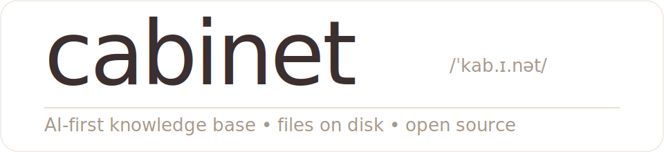

<p align="center">
  
</p>

<h1 align="center">AI Agent 工作站</h1>

<p align="center">
  <strong>Cabinet 知识库 + Multica 任务调度 = 你的本地 AI 团队</strong><br />
  <sub>📋 Issue 看板 &nbsp;•&nbsp; 🤖 多 Agent 并行 &nbsp;•&nbsp; 📚 知识自动沉淀 &nbsp;•&nbsp; 🔒 100% 本地运行</sub>
</p>

<p align="center">
  <a href="https://github.com/8676311081/cabinet/releases"></a>&nbsp;
  <a href="https://github.com/8676311081/cabinet/stargazers"></a>&nbsp;
  <a href="https://github.com/hilash/cabinet"></a>&nbsp;
  <a href="https://github.com/multica-ai/multica"></a>
</p>

---

## 这是什么

把两个开源项目合体，做成一个**双击就能用的 AI Agent 桌面应用**：

- **[Cabinet](https://github.com/hilash/cabinet)** — AI 知识库：Markdown 文件系统 + WYSIWYG 编辑器 + Agent 面板
- **[Multica](https://github.com/multica-ai/multica)** — AI 任务调度：Issue 看板 + 多 Agent 执行 + 实时输出

```
你创建 Issue → Agent 自动认领 → 执行任务 → 产出写入知识库 → 知识越用越多
```

**由 GPT-5 和 Claude Opus 4.6 共同辅助创作。**

---

## 30 秒看懂

| 你做的 | Agent 做的 |
|--------|-----------|
| 创建 Issue："调研 MCP 生态" | 搜索 + 整理 + 写报告到知识库 |
| 创建 Issue："修复登录 bug" | 读代码 + 定位 + 提交 PR |
| 创建 Issue："生成日报" | 拉 GitHub 数据 + 写 Markdown 日报 |
| @11 @二狗 "一起分析" | 两个 Agent 并行工作，各自回复 |

---

## 功能

| 功能 | 说明 |
|------|------|
| **Issue 看板** | 创建任务、设优先级、assign 给 Agent |
| **多 Agent** | 11、二狗、22... 并行执行，@mention 协作 |
| **实时输出** | Agent 工作过程实时可见（thinking/tool/text 流） |
| **知识库** | Markdown 文件系统，Agent 产出自动沉淀 |
| **WYSIWYG 编辑器** | 富文本编辑，代码块，表格，slash 命令 |
| **Git 版本控制** | 每次保存自动 commit，可回滚到任意版本 |
| **项目管理** | 项目 + 子任务 + 看板视图 |
| **收件箱** | Agent 回复/任务完成的通知聚合 |
| **定时任务** | Cron 调度，每天自动跑 GitHub 监控等 |
| **终端** | 内嵌 Web 终端（xterm.js） |
| **100% 本地** | 数据不离开你的机器，嵌入式 PostgreSQL |

---

## 安装

### macOS（推荐）

从 [Releases](https://github.com/8676311081/cabinet/releases) 下载 DMG，双击安装。

启动后 Cabinet 会自动：
- 启动嵌入式 multica-server（端口 18080）
- 创建默认用户和认证 token
- 初始化知识库

### 启动 Agent Daemon

Agent 需要 daemon 进程来执行任务：

```bash
# 安装 multica CLI
brew install multica-ai/tap/multica

# 登录并配置
multica auth login --server-url http://localhost:18080
multica workspace watch <workspace-id>

# 启动 daemon
multica daemon start --foreground
```

需要至少一个 AI CLI：
- **Claude Code**: `npm i -g @anthropic-ai/claude-code`
- **Codex**: `npm i -g @openai/codex`

### 从源码运行

```bash
git clone https://github.com/8676311081/cabinet.git
cd cabinet
npm install
npm run dev:all
```

---

## 跟 Claude Managed Agents 对比

| | Claude Managed Agents | 本项目 |
|---|---|---|
| 运行环境 | Anthropic 云端 | 你的电脑 |
| 费用 | $0.08/session-hour + token | 只有 token 费用 |
| 数据隐私 | 云端 | 100% 本地 |
| 知识沉淀 | 需外接 Notion/Slack | 内置知识库 |
| 自定义 | API 调用 | 完全可控源码 |
| 多 Agent | 支持 | 支持 |
| 实时输出 | WebSocket | WebSocket |

---

## 本 Fork 的改动

详见 [FORK.md](FORK.md)。主要改动：

**Cabinet 侧：**
- Multica 集成（事项/项目/收件箱/智能体）
- 固定端口 18080 + 动态 PAT 认证
- 知识库 sidebar 修复 + 折叠状态持久化
- Create Issue 崩溃修复
- 中文汉化

**Multica 侧：**
- Agent 流式 idle timeout（5min 无输出自动 kill）
- Ghost task 自动清理
- 任务完成后自动 push 到知识库
- 多 assignee 支持
- 知识库索引自动注入 Agent context
- 嵌入式模式 seed owner

---

## 致谢

### 上游开源项目

- **[Cabinet](https://github.com/hilash/cabinet)** by [Hila Shmuel](https://x.com/HilaShmuel) — AI-first 知识库，MIT License
- **[Multica](https://github.com/multica-ai/multica)** by Multica AI — AI Agent 任务调度平台，MIT License

### AI 辅助创作

本项目由 **GPT-5** 和 **Claude Opus 4.6** 共同辅助完成：
- GPT-5：前期架构设计、功能规划
- Claude Opus 4.6 (1M context)：代码实现、调试、Review、测试

---

## License

MIT License — 遵循上游项目的开源协议。
