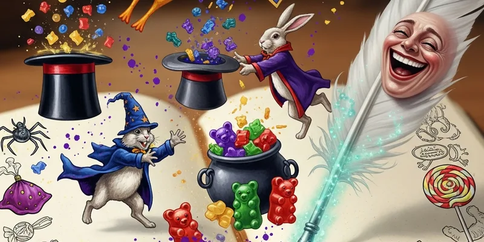

# Joke Book

**"A shop without good jokes is just a warehouse with a cash register."**

This is the approved store banter, display copy, product humour, and counter scripts. Every line has been field-tested on actual customers (and one very patient Ministry inspector). If it made at least three people laugh and zero people file a complaint, it's in.

Fred writes 80% of these. George edits out the ones that would get us shut down. Verity adds the ones that actually help sell things.

---

## Shelf Lines

These go on the display cards next to products:

- "Perfect for birthdays, breakups, and revenge that remains technically festive."
- "If it sparkles, crackles, or briefly becomes a bird, it belongs here."
- "No refunds on products that worked exactly as prankishly intended."
- "Caution: May cause laughter, mild astonishment, and an owl from your mother."
- "Fred tested it. George survived it. You'll love it."
- "Guaranteed to be the most interesting thing that happens to you today."
- "Now with 40% more sparkle and 100% less permanent side effects."
- "The Ministry says we have to tell you this is 'experimental.' We say it's 'adventurous.'"

## Product Jokes

- **Canary Creams:** "For the customer who wants dessert and a short career as a bird."
- **Patronus Pop Rocks:** "The only anxiety-management crystal that actually tastes good."
- **Portable Swamp Taffy:** "For hallways with too much dignity."
- **Moonbeam Meltdrops:** "Finally, a candy that makes your date more interesting AND your tongue glow silver. You're welcome."
- **Canary Cream Supremes:** "Now you're not just a bird — you're a bird that can FLY. Well, glide. Well, fall with style."
- **Extendable Ears:** "For when you absolutely need to know what they said about you after you left."
- **Nosebleed Nougat:** "The world's most delicious sick day."
- **Peruvian Instant Darkness Powder:** "See nothing. Fear everything. Tell no one where you got it."

## Counter Scripts

These are for the shop floor team — tested responses to common customer situations:

- **If a customer asks whether something is safe:** "Safe-ish, charming, and extensively argued over."
- **If a parent asks whether it's educational:** "Emotionally? Absolutely."
- **If Hermione asks for ingredients again:** "Hand her the real list immediately."
- **If a customer tries to return a used prank:** "Sir, the feathers are still in your hair. The product clearly worked."
- **If someone asks 'what's your best seller?':** "The one that's about to sell out. This one. Right now. Shall I wrap it?"
- **If a Slytherin student is browsing:** "We have a premium section. Much more exclusive. (It's the same products in gold packaging.)"
- **If Professor McGonagall walks in:** "Everything here is within Hogwarts guidelines, Professor. Mostly."

## Seasonal Lines

- **Back to School:** "New year, new pranks, same plausible deniability."
- **Valentine's Day:** "Nothing says 'I love you' like a candy that makes your tongue glow. Nothing says 'I'm over you' like a Canary Cream."
- **Christmas:** "Stockings full of mischief. Trees full of sparkle. Parents full of regret they gave you pocket money."
- **End of Term:** "Congratulations on surviving another year. Celebrate with something that sparkles, pops, or briefly violates the laws of physics."

## Lee Jordan's Radio Ad Reads (Unscripted Favourites)

> "Weasleys' Wizard Wheezes — where everything is tested, most things are legal, and all of it is worth the Galleons. Now back to the match, where Hufflepuff is doing something brave and probably doomed—"

> "Pop into 93 Diagon Alley and tell them Lee sent you. They won't give you a discount but they WILL give you a demonstration, and honestly that's better—"

---

See [[Marketing]] for how we use this voice in campaigns. See [[Brand Guide]] for the rules behind the chaos. See [[Candy Catalog]] for the products behind the punchlines.
