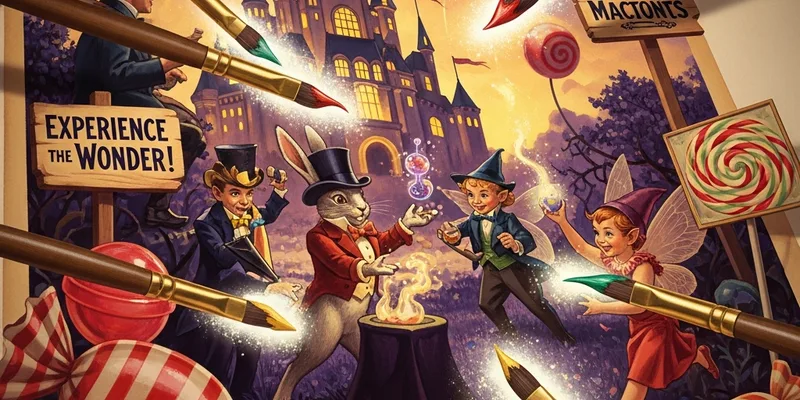

# Marketing

**"We don't do subtle. Subtle is for people who lack confidence in their product."**

Fred runs marketing, and his philosophy is simple: be impossible to ignore. Every campaign should make someone laugh, gasp, or immediately reach for their money pouch. Ideally all three.

This quarter's big push is the **Moonbeam Meltdrops launch** — our first foray into the "romantic evening" market. It's a departure from pure pranks, and Fred is terrified it might be... tasteful.

---

## Q2 Campaign Calendar

| Week | Campaign | Channel | Owner |
|------|----------|---------|-------|
| Apr 7-13 | Moonbeam Meltdrops teaser | Daily Prophet full-page | Fred |
| Apr 14-20 | "Glow Date" influencer kits | Owl Post to 50 tastemakers | Verity |
| Apr 21-27 | Launch day — in-store event | Diagon Alley flagship | All hands |
| May | Patronus Pop Rocks school push | Hogwarts owl drops | Lee Jordan |
| June | Summer bundle campaign | All channels | Fred + Lee |

Campaign performance data is tracked in `campaigns.csv`.

## Active Channels

- **Daily Prophet** — full-page ads, advertorials, "sponsored mischief" column
- **Owl Post Newsletter** — bi-weekly to 2,400 subscribers (see [[Social Media]])
- **Wizarding Wireless Network** — 30-second spots during Quidditch coverage
- **Word of Mouth** — still our #1 channel, and it's free

## Launch Plan: Moonbeam Meltdrops

1. **Week -2:** Teaser campaign — "Something's glowing in Diagon Alley" (mysterious, no product reveal)
2. **Week -1:** Influencer seeding — send kits to Witch Weekly editors, Celestina Warbeck's manager, and select Hogwarts prefects
3. **Launch Day:** In-store event with enchanted ceiling (mimics a starry night), free samples, couples discount
4. **Week +1:** User-generated content push — "Show us your glow" owl-in photo contest
5. **Week +2:** Expand to Hogsmeade and wholesale partners

## Key Resources

- [[Brand Guide]] — voice, colors, typography rules
- [[Social Media]] — channel-specific strategies
- [[Sales]] — alignment on pricing and promotions
- [[Product]] — what's launching and when
- [[owl-post-crm]] — subscriber management

---

## AI Agent Prompts

> **Campaign Brief Generator**
> "Draft a campaign brief for [product name]. Include target audience, key message, channels, timeline, and success metrics. Use our brand voice from the Brand Guide."

> **Ad Copy Writer**
> "Write three versions of a Daily Prophet ad for [product]. One dramatic, one funny, one mysterious. Each under 50 words."

> **Post-Campaign Analysis**
> "Review campaigns.csv and summarize performance for the last 30 days. Highlight top-performing campaigns by engagement and suggest optimizations."
