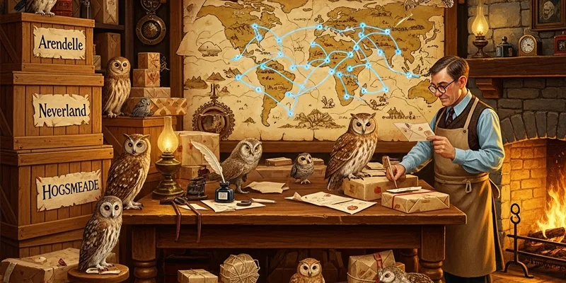

# Shipping Routes

**"Getting pranks into the right hands at the right time — that's the real magic."**

We operate three delivery networks, each with its own quirks, costs, and occasional catastrophes. The key to our logistics is redundancy: if one network goes down (looking at you, Floo during flu season), we pivot instantly.

---

## Network Overview

| Network | Speed | Cost | Reliability | Best For |
|---------|-------|------|-------------|----------|
| Floo Network | Same-day | 3 Sickles/parcel | 95% (except holidays) | High-value, urgent orders |
| Owl Post | 1-3 days | 1 Sickle/parcel | 88% (weather-dependent) | Standard orders, subscriptions |
| Knight Bus Freight | Next-day | 5 Knuts/bulk crate | 72% (things arrive dented) | Wholesale, bulk restock |

## Route Details

### [[Diagon Alley]]
Our primary retail hub and the heart of the operation. Daily Floo shipments, partner shop restocking, and walk-in wholesale pickup. This is where the Galleons flow fastest.

### [[Hogsmeade]]
Weekend-only delivery hub, but it's a goldmine. Every Hogwarts student with pocket money funnels through here. We run dedicated owl runs and direct delivery during term time.

### International (Coming Q3)
George has been in talks with Beauxbatons' student council. The French market is untapped and apparently obsessed with anything that sparkles. Moonbeam Meltdrops are going to crush it there.

---

## Delivery Rules

1. **No Portable Swamp products via Owl Post** — we learned this the hard way. The owls refused to work for a week.
2. **Floo deliveries must be double-wrapped** — soot contamination ruins the shimmer on Meltdrops
3. **Knight Bus shipments need shock-absorbing charms** — mandatory since the Great Pop Rock Incident of Q1
4. **All international shipments require Ministry export clearance** — yes, even the harmless ones. Especially the harmless ones.

## Back to [[Operations]]
