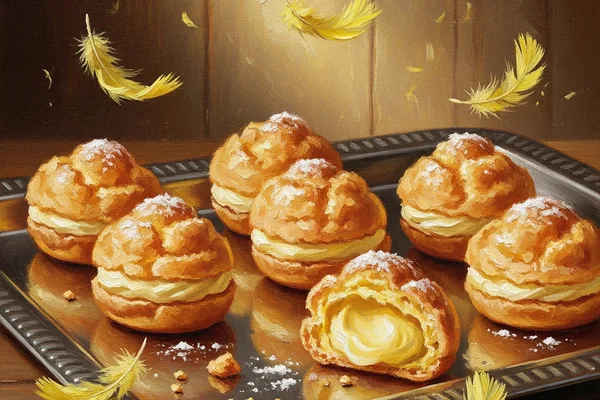

# Canary Cream Supremes

**"You loved becoming a canary. Now imagine becoming a canary THAT CAN FLY."**

The classic Canary Cream — our founding product, our first love, the prank that launched an empire — now upgraded with 30 seconds of actual flight capability. We're not talking "floaty hovering." We're talking wings-out, across-the-room, genuine flight.

Mostly controlled. Largely safe. Absolutely hilarious.

---

## Product Details

| Attribute | Detail |
|-----------|--------|
| **Flavor** | Lemon custard (the original recipe, untouched since day one) |
| **Effect** | Full canary transformation + 30 seconds of flight |
| **Duration** | Transformation: 90 seconds total. Flight window: seconds 15-45. |
| **Ministry Rating** | Pending (Class B — Temporary Transfiguration, Enhanced) |
| **Price** | 5 Galleons (Standard-Premium tier) |
| **Target Market** | Prank enthusiasts, party hosts, anyone who's ever wanted to fly |
| **Safety** | Mostly harmless |

## What's New

The original Canary Cream turned you into a canary for about 60 seconds. Funny, but you just... stood there. Being a bird. On the ground.

The Supremes version adds functional wings. At the 15-second mark of transformation, the enchantment shifts to include a Levitation-Flight hybrid charm. For 30 glorious seconds, you're a canary that can actually fly around the room.

Fred calls it "the greatest product upgrade in prank history." George calls it "the reason I have to fill out Ministry paperwork for the next three months."

## Safety Notes

- **Landing:** The charm includes a cushioned descent. You don't plummet — you glide down gracefully in the final 5 seconds.
- **Height limit:** Built-in ceiling of 4 metres. We tested without the ceiling limit once. Ron still doesn't talk about it.
- **Allergies:** Same as original Canary Cream. If you're allergic to standard Transfiguration pastries, consult a Healer.
- **Age restriction:** 13+ recommended. Under 13 requires parental consent (and probably parental filming).
- **Indoor use only.** We CANNOT stress this enough. Outdoor use risks actual bird-related incidents (owls, hawks, and one deeply confused pigeon).

## Development History

1. **V1 (Original):** Ground-based canary transformation. The classic.
2. **V2 (Hover):** Added 5 seconds of hovering. Customers wanted more.
3. **V3 (Supremes):** Full 30-second flight. Currently in Phase 3 trials.

Phase 3 volunteers have reported "pure joy" (14 testers), "brief terror followed by pure joy" (4 testers), and "I want to do it again immediately" (all 18 testers).

---

See [[Candy Catalog]] for the full product lineup. See [[Product]] for launch timeline.
