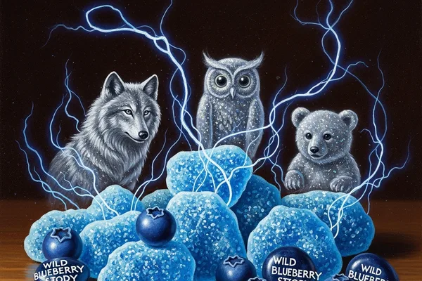

# Patronus Pop Rocks

**"All the joy of a Patronus Charm, none of the emotional trauma required to cast one."**

Pop rocks that crackle and fizz on your tongue, and as they do, a tiny translucent Patronus shape forms above your open mouth. It lasts about 4 seconds, it's different for everyone, and students absolutely lose their minds over it.

---

## Product Details

| Attribute | Detail |
|-----------|--------|
| **Flavor** | Wild blueberry with a tingle of Cheering Charm essence |
| **Visual Effect** | Translucent Patronus shape forms above the mouth (3-4 seconds) |
| **Duration** | Pop rocks: 30 seconds. Patronus: 3-4 seconds at peak fizz. |
| **Ministry Rating** | Safe (Class A — Decorative Enchantment, pending final review) |
| **Price** | 3 Galleons (Standard tier) |
| **Target Market** | Hogwarts students, teens, "try this!" social moments |
| **Shelf Life** | 4 months (pop charm weakens over time) |

## The Hook

Everyone wants to know what their Patronus looks like. Most people can't cast the charm. These pop rocks solve that problem for 3 Galleons and zero existential crisis. The Patronus shape is determined by the consumer's emotional state at the moment of peak fizz — so it's genuinely personal every time.

Top reported shapes: stag, otter, hare, phoenix, and one memorable "shapeless blob" that turned out to be a particularly round hedgehog.

## Target Market Deep Dive

Hogwarts students are the core audience. This is a social product — nobody eats these alone. The typical scenario:

1. One student buys a pack
2. They try it in front of friends
3. Everyone screams about the Patronus shape
4. Four more students buy packs
5. The whole common room is doing it by evening

Word-of-mouth multiplier is the highest of any product in our catalog.

## Current Testing Status

- Flavor: finalized
- Pop rock intensity: finalized
- Patronus clarity: 85% success rate (target: 95% before launch)
- Shape variety: sufficient (47 confirmed shapes and counting)
- Failure mode: occasionally produces no Patronus if consumer is "emotionally neutral" — George is working on the charm sensitivity

## Competitive Advantage

Nobody else is doing this. Honeydukes has "Magical Fizz Drops" but they just... fizz. No Patronus. No personality. No story. Ours has all three, and costs the same.

---

See [[Candy Catalog]] for the full lineup. See [[Product]] for launch timing.
