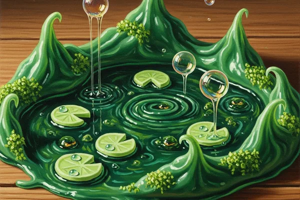

# Portable Swamp Taffy

**"It creates a small, decorative swamp. On purpose. From your mouth. We're still working on the 'small' and 'decorative' parts."**

HIGHLY EXPERIMENTAL. This product is not yet approved for sale, is not yet approved by the Ministry, and is not yet approved by George, who insists the current version is "nearly controlled" — a phrase that has never once been reassuring.

---

## Product Details

| Attribute | Detail |
|-----------|--------|
| **Flavor** | Spearmint with bog essence (earthy, surprisingly pleasant) |
| **Effect** | Creates a miniature swamp in a 1-metre radius when chewed |
| **Duration** | Swamp persists for 10-45 minutes (this is the problem) |
| **Ministry Rating** | NOT YET SUBMITTED (Class C — Environmental Enchantment) |
| **Price** | TBD (George refuses to price something that "isn't finished") |
| **Target Market** | Advanced pranksters, event decorators, people Fred describes as "fun" |
| **Safety** | Under review |

## The Vision

Fred's pitch: "Imagine you're at a boring party. You pop a taffy. Suddenly — ambiance. Lily pads, gentle mist, maybe a frog. The party is no longer boring. You're a hero."

George's counterpoint: "Imagine you're in a Ministry elevator. Someone pops a taffy. The elevator is now a swamp. Everyone's shoes are ruined. We're in Azkaban."

The truth is somewhere in between, and we're working on getting it closer to Fred's version.

## Current State of R&D

### What Works
- The swamp is genuinely beautiful. Bioluminescent moss, tiny lily pads, the occasional decorative frog.
- The spearmint flavor is excellent. Best-tasting experimental product we've made.
- Customers in concept testing LOVE the idea. 94% said they'd buy it.

### What Doesn't Work (Yet)
- **Size control:** Target is 1-metre radius. Current range: 0.5 to 4 metres. The variance is... unacceptable.
- **Duration control:** Should last 10 minutes. Sometimes lasts 45. Once lasted overnight (the back room still smells like bog).
- **Containment:** The swamp occasionally spreads beyond the target radius if the surface is flat. Carpeted rooms are safer. Tiled floors are a disaster.
- **Cleanup:** Vanishing the swamp requires a specific counter-charm. We need to include one in the packaging.

## Path to Launch

1. Solve containment (George is working on a boundary charm baked into the taffy itself)
2. Standardize duration to 10 minutes (+/- 2 minutes)
3. Include counter-charm sachet in packaging
4. Submit to Ministry for Class C review
5. Phase 1 testing per [[Safety Protocols]]
6. Pray

## George's Official Position

> "I'm not saying it will never launch. I'm saying it will launch when it stops creating swamps in places I didn't authorize swamps. Which, at current trajectory, is Q4. Maybe Q1 next year. Maybe never. Fred, stop telling people it's launching in June."

---

See [[Candy Catalog]] for the full product lineup. See [[Research]] for experiment data. See [[Safety Protocols]] for Ministry compliance requirements.
