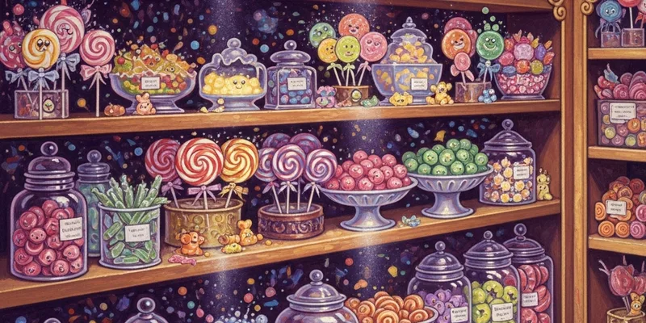

# Product

**"If it doesn't make someone's day more interesting, it's not a Weasley product."**

This is the product hub — where ideas become prototypes, prototypes become products, and products become the reason Hogwarts students spend their entire allowance in one afternoon.

Fred and George co-own the product vision, but the division is clear: Fred dreams it, George makes it not explode (usually), and Verity tells them both whether customers will actually buy it.

---

## This Quarter's Launches

| Product | Stage | Target Launch | Owner |
|---------|-------|---------------|-------|
| Moonbeam Meltdrops | Production ready | April 21 | George |
| Patronus Pop Rocks | Final testing | May 5 | George |
| Canary Cream Supremes | Phase 3 trials | May 19 | Fred |
| Portable Swamp Taffy | R&D (experimental) | TBD | George |

Full product data is tracked in `candy-roadmap.csv`.

## Product Sections

- [[Candy Catalog]] — master catalog of all products with status and pricing
- [[Pricing Strategy]] — tier structure, margins, and positioning

## Product Development Process

1. **Idea** — Fred has a shower thought, George writes it down properly
2. **Concept** — Quick prototype, usually tested on willing (or unsuspecting) family members
3. **R&D** — Formal experimentation in the [[Research]] lab
4. **Safety** — Ministry compliance review (see [[Research]] safety protocols)
5. **Production** — Scaling the recipe, packaging design, shelf placement
6. **Launch** — Marketing blitz, in-store event, Hogsmeade distribution

## Key Metrics

| Metric | Q1 Actual | Q2 Target |
|--------|-----------|-----------|
| Products launched | 2 | 4 |
| Avg. customer rating | 8.1/10 | 8.5/10 |
| Return rate | 3.2% | <2% |
| Time to market (idea to shelf) | 8 weeks | 6 weeks |

## Cross-References

- [[Research]] — what's still in the lab
- [[Operations]] — production and shipping capacity
- [[Candy Catalog]] — the full product lineup
- [[Pricing Strategy]] — how we price it all
