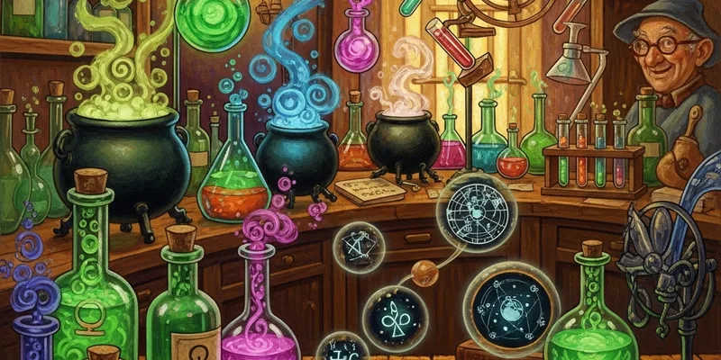

# Research

**"Science is just pranking nature until it tells you something useful."**

Welcome to the R&D wing of Weasleys' Wizard Wheezes, where brilliant ideas go to be tested, refined, and occasionally to set off the fire suppression charms. George oversees research because Fred's version of "testing" is "give it to Ron and see what happens."

The rule is simple: if it delights customers and does not create a permanent swamp, it can move forward. (The swamp threshold is currently under review. George insists "nearly controlled" is not the same as "controlled." Fred disagrees.)

---

## Active Research Tracks

| Track | Lead | Status | Risk Level |
|-------|------|--------|------------|
| Moonbeam Meltdrops flavor refinement | George | Complete | Low |
| Patronus Pop Rocks shape consistency | George | In testing | Medium |
| Canary Cream flight duration extension | Fred | Phase 2 | Medium |
| Portable Swamp Taffy containment | George | ONGOING | High |
| Invisible Hat (concept phase) | Fred | Sketching | Unknown |

## Key Files

- `prank-experiments.csv` — structured experiment log with dates, results, and incident reports

## Research Sections

- [[Flavor Prophecies]] — tasting notes, customer signals, flavor trend analysis
- [[Safety Protocols]] — Ministry compliance, testing phases, the rules we actually follow
- [[prank-lab]] — the interactive experiment tracker (embedded app)

## Current Questions

- Which new candy feels premium enough for gift boxes?
- Which prank can be sold safely to students with poor impulse control?
- Can we extend Canary Cream flight to 30 seconds without violating the Enchanted Consumables Act?
- Is there a way to make Portable Swamp Taffy NOT create an actual swamp? (George: "That would defeat the entire purpose.")
- Which ideas are funny only in theory and should stay there?

## Cross-References

- [[Product]] — what's graduating from R&D to production
- [[Safety Protocols]] — the boring but legally essential bits

---

## AI Agent Prompts

> **Experiment Summary**
> "Review prank-experiments.csv and summarize results from the last 2 weeks. Flag any experiments with 'incident' in the notes column."

> **Safety Review Draft**
> "Based on the latest experiment data, draft a Ministry safety submission for [product name]. Include test phases completed, known side effects, and recommended age rating."

> **Flavor Trend Analysis**
> "Read Flavor Prophecies and prank-experiments.csv together. Identify which flavor profiles correlate with highest customer satisfaction scores."
