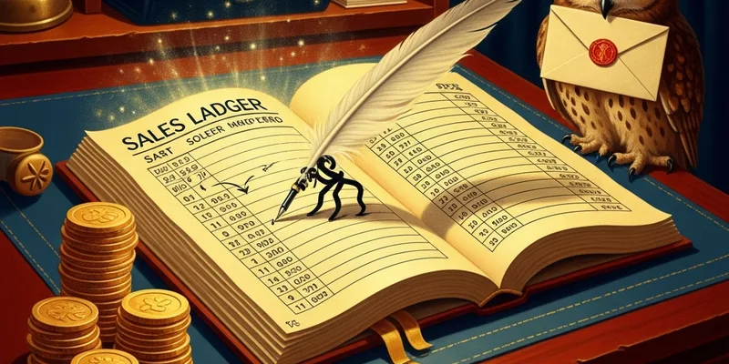

# Sales

**"Every witch and wizard is one demonstration away from opening their money pouch."**

Sales at Weasleys' Wizard Wheezes isn't about hard selling — it's about spectacle. Our products sell themselves once people *see* them in action. Our job is to make sure they see them, understand them, and can't possibly leave without buying at least three things they didn't know they needed.

---

## CRM Overview

Our customer relationship data lives in `leads.csv` and the [[owl-post-crm]] dashboard. Every customer interaction — walk-in, owl order, wholesale inquiry — gets logged.

### Pipeline Stages

| Stage | Description | Target Conversion |
|-------|-------------|-------------------|
| Awareness | Heard of us, hasn't visited | 40% to Interest |
| Interest | Visited shop or opened newsletter | 60% to Trial |
| Trial | Tried a sample or bought once | 45% to Repeat |
| Repeat | 3+ purchases | 30% to Advocate |
| Advocate | Refers friends, writes reviews | Maintain and delight |

## Customer Personalities

We've identified four core buyer archetypes. Know your customer, close the sale:

### The Hermione (Quality-Driven)
- **Wants:** Proof it works, safety data, clever design
- **Approach:** Lead with craftsmanship and R&D story. Mention Ministry safety ratings.
- **Trigger phrase:** "This took us six months to perfect."
- **Avoid:** Hype without substance. She'll see right through it.

### The Draco (Luxury-Seeking)
- **Wants:** Exclusivity, premium packaging, something to show off
- **Approach:** Collector editions, gold packaging, "limited batch" language
- **Trigger phrase:** "This is from our private collection."
- **Avoid:** Mentioning the budget line. Ever.

### The Luna (Surreal & Curious)
- **Wants:** The weirdest thing in the shop. The more inexplicable, the better.
- **Approach:** Tell the origin story. The weirder the R&D process, the more she's in.
- **Trigger phrase:** "Even we're not entirely sure what it does."
- **Avoid:** Over-explaining. Let the mystery breathe.

### The Lee Jordan (Promo & Social)
- **Wants:** Bulk deals, things to share, products that create stories
- **Approach:** Party packs, bulk discounts, "imagine using this at..." scenarios
- **Trigger phrase:** "Buy ten and we'll throw in the detonator."
- **Avoid:** Anything boring. If it doesn't make a good story, he's not interested.

---

## Key Resources

- [[Deal Playbook]] — closing strategies by customer type
- [[owl-post-crm]] — live customer dashboard
- [[Marketing]] — campaign coordination and lead generation
- [[Operations]] — fulfillment and shipping alignment

## Q2 Sales Targets

- **Total revenue:** 12,000 Galleons
- **New customers:** 400
- **Repeat rate:** 45%
- **Average basket size:** 6.5 Galleons (up from 5.2 in Q1)
- **Wholesale accounts:** 3 new partners
