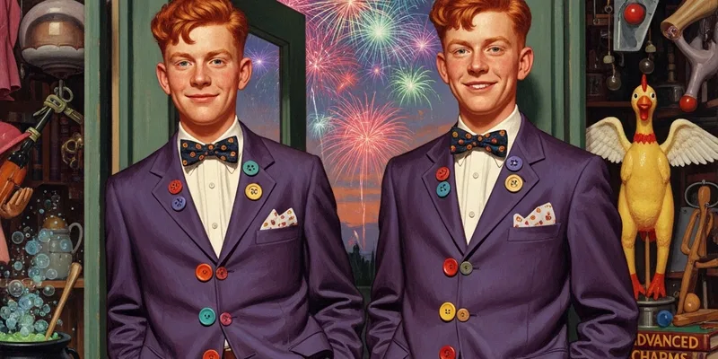

# Team

**"Four people running a magical empire. Five if you count the enchanted cash register, and honestly, it pulls its weight."**

We're small, we're loud, and we're absurdly effective. Every person on this team was chosen because they're brilliant at what they do AND because they can survive working with Fred.

---

## Org Chart

| Name | Role | Focus | Strength |
|------|------|-------|----------|
| [[Fred Weasley]] | Co-Founder | Product & Marketing | "The spark" — ideas, launches, showmanship |
| [[George Weasley]] | Co-Founder | Ops & R&D | "The steady hand" — operations, safety, making things actually work |
| [[Verity]] | Shop Manager | Customer Experience | The glue — inventory, service, keeping Fred grounded |
| [[Lee Jordan]] | Partnerships & Promo | Business Development | "Knows everyone" — connections, hype, Quidditch network |

## How We Work

- **Fred + George** are the founders and the creative engine. Fred generates ideas at roughly the rate of a fireworks display. George catches the good ones and makes them not explode (or explode in the right way).
- **Verity** runs the shop floor, manages inventory, handles customer issues, and is the only person Fred consistently listens to. She has veto power on anything customer-facing.
- **Lee Jordan** is part-time but punches well above his hours. His Quidditch network reaches every common room in Hogwarts, and his radio voice has sold more product than any ad we've ever run.

## Team Culture

- **Move fast, test everything.** Speed matters, but so does not accidentally creating a permanent swamp.
- **Everyone sells.** Even George does floor shifts on Hogsmeade weekends.
- **Disagree and commit.** Fred and George disagree on roughly 40% of decisions. They resolve it fast and move on. (Fred usually concedes on safety. George usually concedes on branding.)
- **Celebrate wins.** Every product launch gets a team dinner at the Leaky Cauldron. Every sales milestone gets a round of Butterbeers. Life's too short to only celebrate the big ones.

---

Read more about each team member on their individual pages above.
